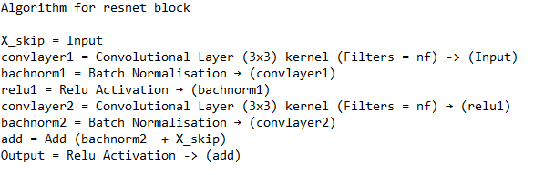

Resnet Block

First is to initialize the conv2d layer. Then, is to create the skip connection - x_skip - based on the input x. Later, re-add this variable to the output of the residual block, which creates the skip connection. Finally, the combined output/skip connection is nonlinearly activated with ReLU before being passed to the next residual block.
